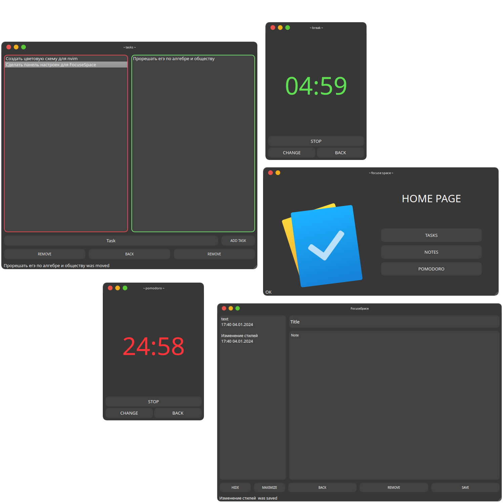

<h1>FOCUSE WORKSPACE</h1>

<div id="statusBadges" align=center>
	
	
	
</div>

<div id="social" align=center>
	<a href="https://discord.gg/#9707" target="blank"></a>
	<a href="https://t.me/Night3098" target="blank"></a>
	<a href="mailto:night3098game@gmail.com" target="blank"></a>
	<a href="https://www.reddit.com/user/Night3098" target="blank"></a>
</div>

<div id="soft" align=center>
	
	
	
	
</div>

</img>

<h1> INSTALLING</h1>

> !!! For the app to work, you need to install QT !!!

```shell
git clone https://github.com/Nighty3098/FocuseSpace
cd FocuseSpace
bash build.sh
```

> The compiled file is located in the directory : src/FocuseSpace/FocuseSpace

<h1>TO-DO</h1>

- [x] Add tasks manager
- [x] Add pomodoro timer and notes manager
- [x] New Ui
- [x] Add data saving to the database
- [ ] Add colorsheme preferences
- [ ] Add dark and light theme
- [ ] Add more functionality
- [ ] Add user preferences
- [ ] Make an application for android
- [ ] Add login with user name and password
